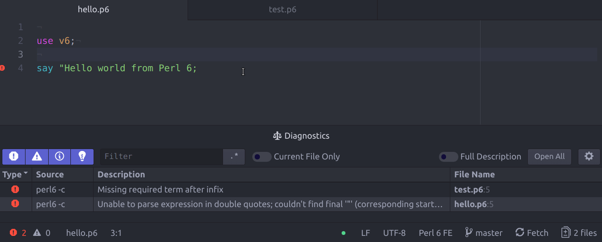

# IDE-Perl6

Perl 6 language support for the [Atom IDE](https://atom.io/packages/atom-ide-ui)
powered by `perl6-langserver.p6` (`App::Perl6LangServer` in the future).

This Language integration is built on top of
[atom-languageclient](https://github.com/atom/atom-languageclient).


## Features:
- Diagnostics (i.e. syntax check errors using `perl6 -c` )



## Plan:
- [ ] `perl6-langserver.p6` should be moved into `App::Perl6LangServer`
- [ ] Provide a feature list similar to https://github.com/rust-lang-nursery/atom-ide-rust
- [ ] Auto-install `App::Perl6LangServer`
- [ ] Support VSCode.

## Install

- You can install from the command line with:

```bash
$ apm install ide-perl6
```

 - Or you can install from the settings view (`Ctrl` + `,`) by searching for
 `ide-perl6`.

Note: you need to have a working  installed Rakudo Perl 6 Compiler. You can
install the latest monthly pre-compiled packages from
 [nxadm/rakudo-pkg](https://github.com/nxadm/rakudo-pkg) or Rakudo Star
 distribution from [here](https://rakudo.org/files).

## Debugging

If the plugin is not working as expected, you can try enabling logging to debug
it:

- Open the atom console via `Ctrl` + `Shift` + `I`.
- Enter `atom.config.set('core.debugLSP', true)` in the console.
- Reload Atom via `Ctrl` + `Shift` + `F5`.

## Author

Ahmad M. Zawawi, [azawawi](https://github.com/azawawi/) on #perl6.

## License

[MIT License](LICENSE.md)
